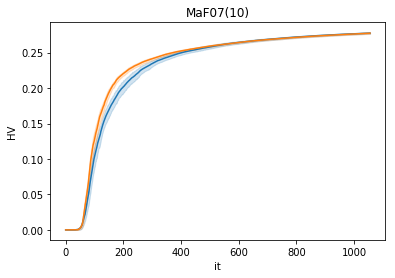
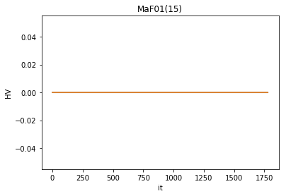
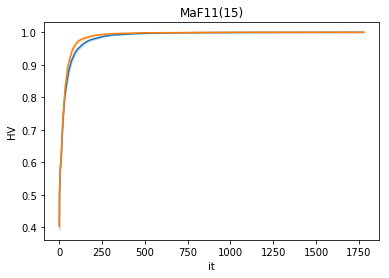

```python
import numpy as np
import pandas as pd
import matplotlib.pyplot as plt
import seaborn as sns
import os


probs=["MaF01", "MaF02", "MaF03", "MaF04", "MaF05",
       "MaF06", "MaF07", "MaF08", "MaF09", "MaF10",
       "MaF11", "MaF12", "MaF13", "MaF14", "MaF15"]
runs = [str(i) for i in range(0, 20)]
    
def plot_m(m, pop_size):
    for prob in probs:
        path="../MaFMethodology/%s/hhco/%s/%s/output/"%(m,"HHCOR2",prob)
        df = pd.read_csv(path+"HVI.csv")
        sns.lineplot(x="it", y="HV", data=df, dashes=False)

        path="../MaFMethodology/%s/hhco/%s/%s/output/"%(m,"HHCORandom",prob)
        df = pd.read_csv(path+"HVI.csv")
        sns.lineplot(x="it", y="HV", data=df, dashes=False)
        plt.title("%s(%s)"%(prob, m))
        plt.show()
        path="../MaFMethodology/%s/hhco/output"%(m)
        if not os.path.exists(path):
            os.mkdir(path)
        plt.savefig("%s/hvi_%s_%s.eps"%(path, prob, m), format='eps')

```


```python
plot_m(m=5, pop_size=210)
plot_m(m=10, pop_size=275)
plot_m(m=15, pop_size=135)
```











    <Figure size 432x288 with 0 Axes>


```python

```
