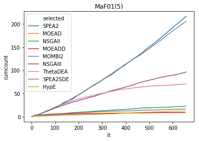
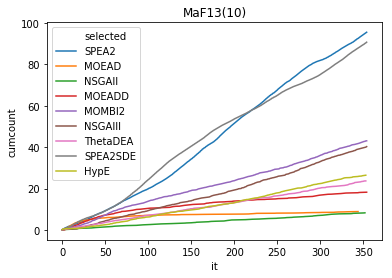
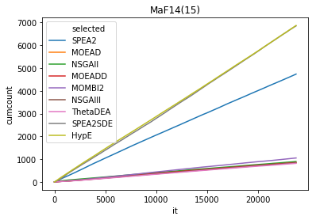

```python
import numpy as np
import pandas as pd
import matplotlib.pyplot as plt
import seaborn as sns

probs=["MaF01", "MaF02", "MaF03", "MaF04", "MaF05",
       "MaF06", "MaF07", "MaF08", "MaF09", "MaF10",
       "MaF11", "MaF12", "MaF13", "MaF14", "MaF15"]

def plot_selected(m, alg):
    for prob in probs:
        path="../MaFMethodology/%s/hhco/%s/%s/output/"%(m, alg, prob)
        runs = [str(i) for i in range(0, 20)]
        algs=["SPEA2","MOEAD","NSGAII","MOEADD","MOMBI2","NSGAIII","ThetaDEA","SPEA2SDE","HypE"]
        df_list=[]
        for run in runs:
            df = pd.read_csv(path+"selected."+run, names=["selected"])
            df['it'] = np.arange(len(df))
            df['run'] = run
            df_list.append(df)

        df = pd.concat(df_list)
        df = df.groupby(['selected', 'it']).size()
        df = df.to_frame(name = 'count').reset_index()
        df['count'] = df['count'] / 20
        df['cumcount'] = df.groupby(['selected'])['count'].cumsum()
        for i in range(0, len(algs)):
            df.loc[df['selected']==i, 'selected'] = algs[i]

        sns.lineplot(x="it", y="cumcount", hue="selected", data=df, dashes=False).set_title("%s(%s)"%(prob, m))
        plt.show()
        plt.savefig("%s/selected_%s_%s_%s.eps"%(path, alg, prob, m), format='eps')

plot_selected(m=5, alg="HHCOR2")
plot_selected(m=10, alg="HHCOR2")
plot_selected(m=15, alg="HHCOR2")

# plot_selected(m=5, alg="HHCORandom")
# plot_selected(m=10, alg="HHCORandom")
# plot_selected(m=15, alg="HHCORandom")

```











    <Figure size 432x288 with 0 Axes>


```python

```
