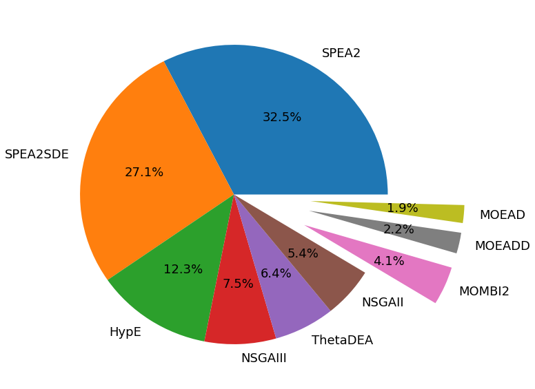

```python
import numpy as np
import pandas as pd
import matplotlib.pyplot as plt
import seaborn as sns

summary = pd.DataFrame()

probs=[
       "MaF01", "MaF02", "MaF03", "MaF04", "MaF05", "MaF06", "MaF07", "MaF08", "MaF09", 
       "MaF10", "MaF11", "MaF12", "MaF13", "MaF14", "MaF15"
      ]

alg="HHCOR2"

for m in [5, 10, 15]:
    for prob in probs:
        path="../MaFMethodology/%s/full/%s/%s/output/"%(m, alg, prob)
        runs = [str(i) for i in range(0, 20)]
        algs=["SPEA2","MOEAD","NSGAII","MOEADD","MOMBI2","NSGAIII","ThetaDEA","SPEA2SDE","HypE"]
        df_list=[]
        for run in runs:
            df = pd.read_csv(path+"selected."+run, names=["Selected"])
            df['it'] = np.arange(len(df))
            df['run'] = run
            df_list.append(df)
        maxit = df.max()['it']

        df = pd.concat(df_list)
        df = df.groupby(['Selected', 'it']).size()
        df = df.to_frame(name = 'count').reset_index()
        df['count'] = df['count'] / 20 # divided by 20 independent runs
        df['countnorm'] = df['count'] / maxit # divided by max iterations
        df['cumcount'] = df.groupby(['Selected'])['countnorm'].cumsum()    
        df['prob'] = "%s(%s)"%(prob, m)


        for i in range(0, len(algs)):
            df.loc[df['Selected']==i, 'Selected'] = algs[i]

        summary = summary.append(df.groupby(['Selected']).max())


```


```python
    
# summary
df = summary.groupby(['Selected']).mean().reset_index()

# df.plot.pie(y='cumcount', labels=df['Selected'], autopct='%1.1f%%', explode=(1, 1, 1, 1, 0, 0, 0, 0, 0))

df = df.sort_values(['cumcount'], ascending=False)

plt.figure(figsize=(10, 10))
plt.pie(df['cumcount'], 
        labels=df['Selected'], 
        autopct='%1.1f%%', 
        textprops={'fontsize': 18}, 
        explode=(0, 0, 0, 0, 0, 0, 0.5, 0.5, 0.5))
plt.show()
```





```python

df.cumsum()

```


<div>
<style scoped>
    .dataframe tbody tr th:only-of-type {
        vertical-align: middle;
    }

    .dataframe tbody tr th {
        vertical-align: top;
    }

    .dataframe thead th {
        text-align: right;
    }
</style>
<table border="1" class="dataframe">
  <thead>
    <tr style="text-align: right;">
      <th></th>
      <th>Selected</th>
      <th>it</th>
      <th>count</th>
      <th>countnorm</th>
      <th>cumcount</th>
    </tr>
  </thead>
  <tbody>
    <tr>
      <td>6</td>
      <td>SPEA2</td>
      <td>2452.8</td>
      <td>0.646667</td>
      <td>0.000753333</td>
      <td>0.325338</td>
    </tr>
    <tr>
      <td>7</td>
      <td>SPEA2SPEA2SDE</td>
      <td>4905.51</td>
      <td>1.25444</td>
      <td>0.00145132</td>
      <td>0.596712</td>
    </tr>
    <tr>
      <td>0</td>
      <td>SPEA2SPEA2SDEHypE</td>
      <td>7354.58</td>
      <td>1.67778</td>
      <td>0.00189877</td>
      <td>0.719219</td>
    </tr>
    <tr>
      <td>5</td>
      <td>SPEA2SPEA2SDEHypENSGAIII</td>
      <td>9803.2</td>
      <td>2.01333</td>
      <td>0.00230226</td>
      <td>0.794265</td>
    </tr>
    <tr>
      <td>8</td>
      <td>SPEA2SPEA2SDEHypENSGAIIIThetaDEA</td>
      <td>12252.3</td>
      <td>2.32222</td>
      <td>0.00267658</td>
      <td>0.858172</td>
    </tr>
    <tr>
      <td>4</td>
      <td>SPEA2SPEA2SDEHypENSGAIIIThetaDEANSGAII</td>
      <td>14695.9</td>
      <td>2.62333</td>
      <td>0.00300514</td>
      <td>0.912547</td>
    </tr>
    <tr>
      <td>3</td>
      <td>SPEA2SPEA2SDEHypENSGAIIIThetaDEANSGAIIMOMBI2</td>
      <td>17134.5</td>
      <td>2.91444</td>
      <td>0.00334982</td>
      <td>0.954008</td>
    </tr>
    <tr>
      <td>2</td>
      <td>SPEA2SPEA2SDEHypENSGAIIIThetaDEANSGAIIMOMBI2MO...</td>
      <td>19564.7</td>
      <td>3.18556</td>
      <td>0.00369244</td>
      <td>0.976457</td>
    </tr>
    <tr>
      <td>1</td>
      <td>SPEA2SPEA2SDEHypENSGAIIIThetaDEANSGAIIMOMBI2MO...</td>
      <td>21998.8</td>
      <td>3.49222</td>
      <td>0.00406261</td>
      <td>0.995713</td>
    </tr>
  </tbody>
</table>
</div>


